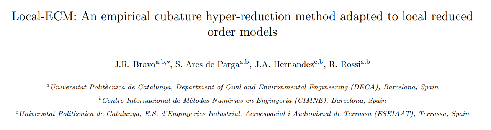
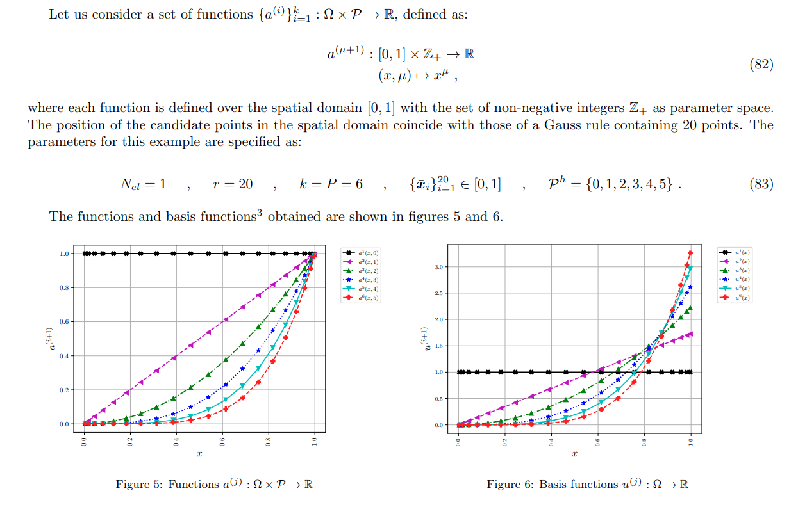
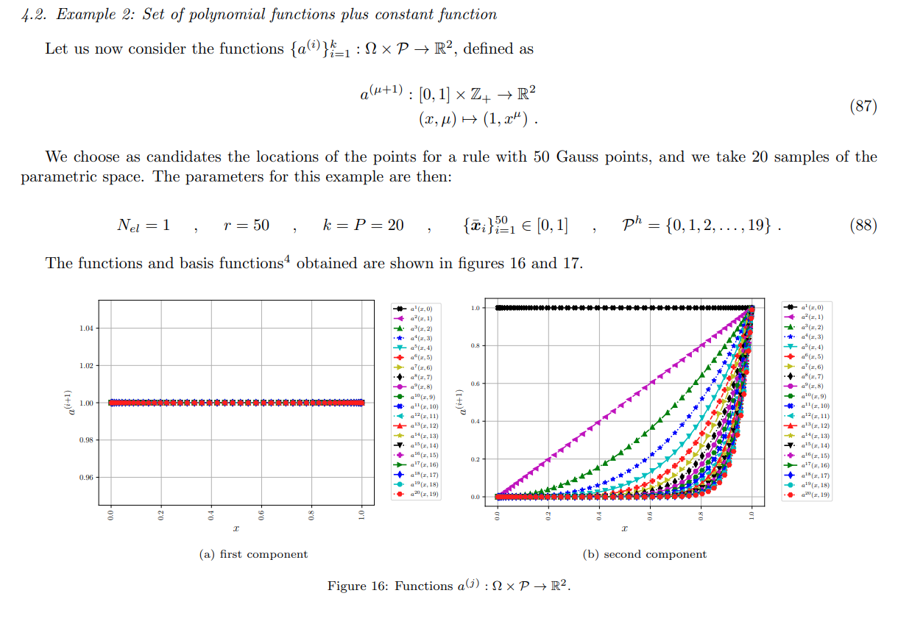
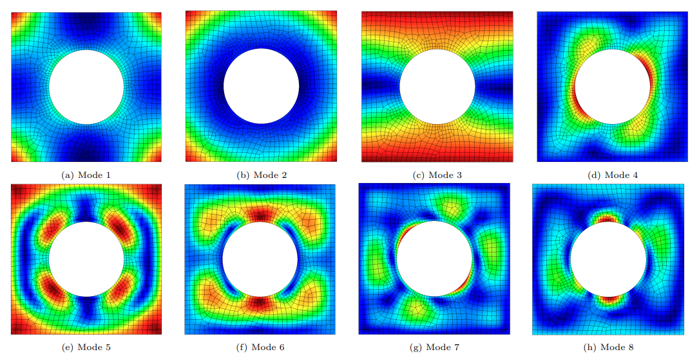
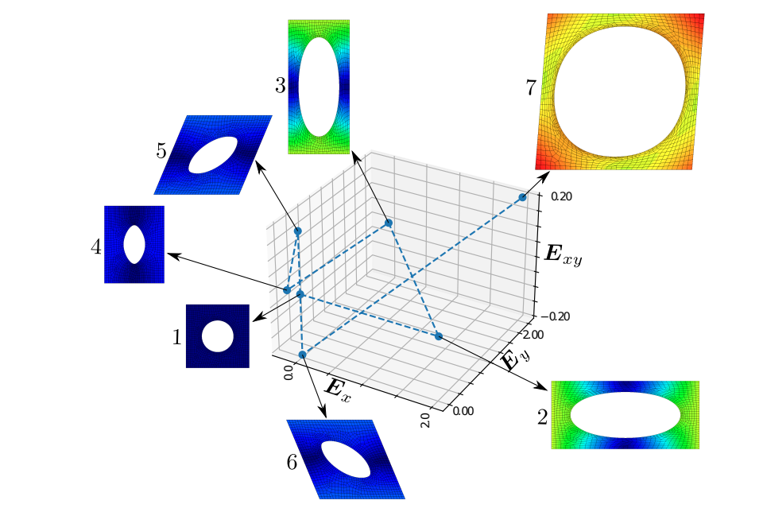
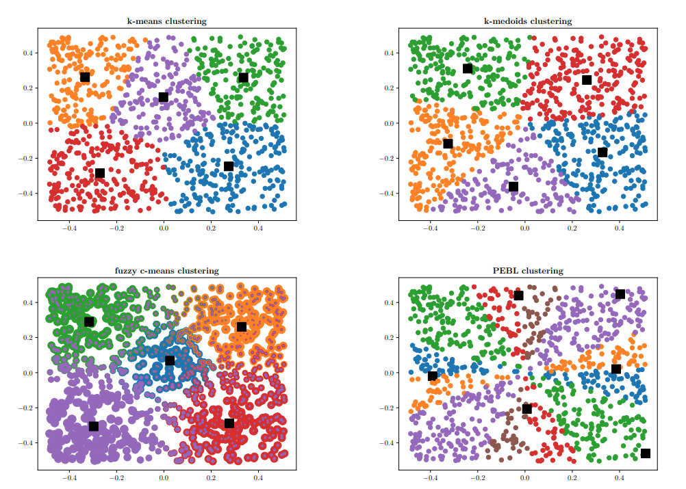

# Contents
This folder contains the Python scripts required to reproduce the examples from [this paper](https://arxiv.org/abs/2310.15769).

# Example 1
## Polynomial approximation (section 4.1)

To reproduce this example,use the [Example.py](Example.py) with the following parameters:


```python
if __name__ == '__main__':

    number_of_functions = 6
    number_of_candidate_Gauss_points = 20

    function_to_use = 1 # 1 or 2
    constrain_sum_of_weights = False #this avoids the trivial solution
    use_L2_weighting = True # True  # if True: d = G@\sqrt{W}; elif False: d = G@W

    run_example(number_of_functions, number_of_candidate_Gauss_points, function_to_use, constrain_sum_of_weights, use_L2_weighting)
```


# Example 2
##  Set of polynomial functions plus constant function (section 4.2)


To reproduce this example,use the [Example.py](Example.py) with the following parameters:
```python
if __name__ == '__main__':

    number_of_functions = 20
    number_of_candidate_Gauss_points = 50

    function_to_use = 2 # 1 or 2
    constrain_sum_of_weights = False #this avoids the trivial solution
    use_L2_weighting = True # True  # if True: d = G@\sqrt{W}; elif False: d = G@W

    run_example(number_of_functions, number_of_candidate_Gauss_points, function_to_use, constrain_sum_of_weights, use_L2_weighting)
```

# Example 3
## Finite Elements Example (section 4.3)
This example was launched using an in-house Matlab code which we do not provide here.



An observation that we highlight in our paper is the limit case (having as many bases as snapshots) following the trajectory shown next




Here is the evolution of the weights mentioned. 

<p align="center">
  
</p>


# Clustering comparison
The comparison of the clustering techniques shown in our paper is also included in this repository by launching the [clustering_comparison.py](clustering_comparison.py) script.



